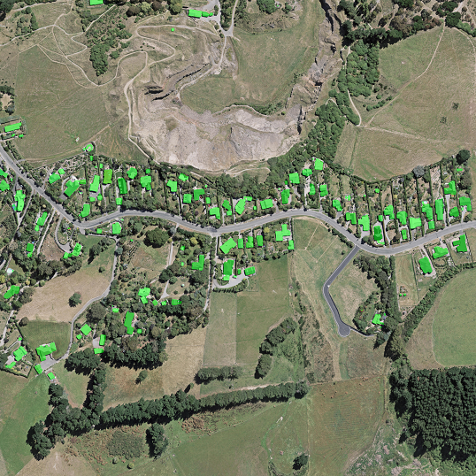
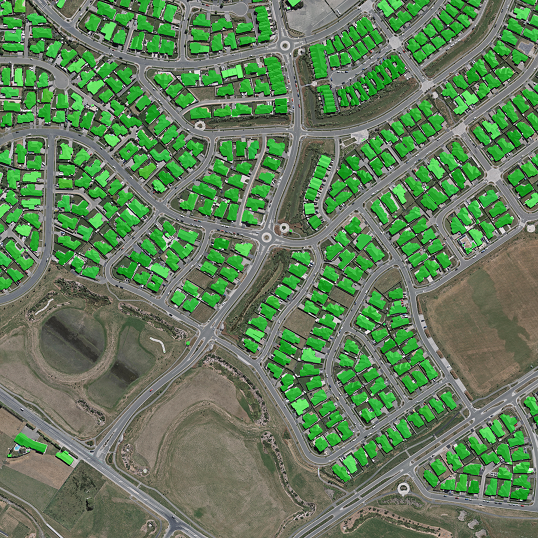
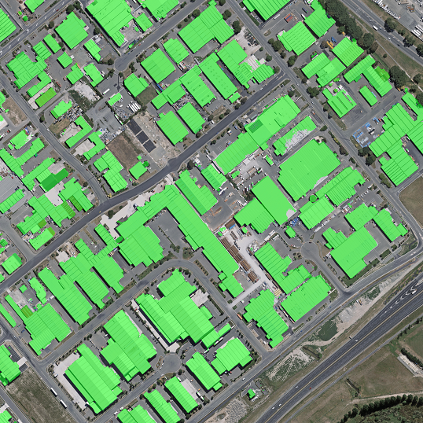

# Rooftop Instance Segmentation using TensorFlow
### Aerial Imagery Dataset provided by National Topographic Office of New Zealand

Link: https://www.airs-dataset.com/

Extract the dataset completely, store in this format:

```bash
# Training images
root/data/train/image
# Labels
root/data/train/label
# Test samples
root/data/test
```

Model Used: VGG-16, Instance Segmentation

If you get dependency error on scipy.misc, downgrade it to 1.0.0

```python
pip install scipy==1.0.0
```

Trained on Nvidia Quadro GP100 with 16GB VRAM. Batch Size:2 Input resolution 3584x3584. (Sharper Edges was primary objective)

Training Time: 12 hours

Sample Outputs (downsized):

 

